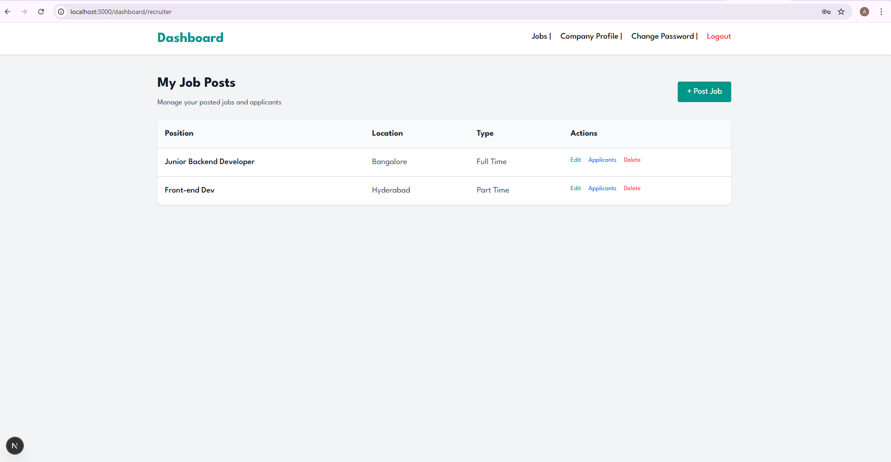
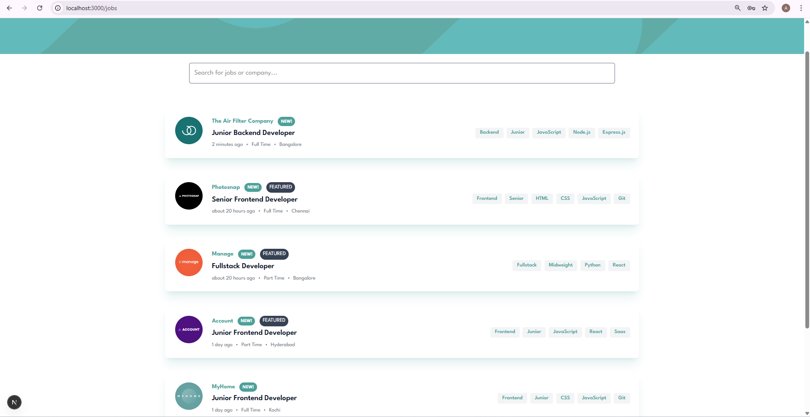
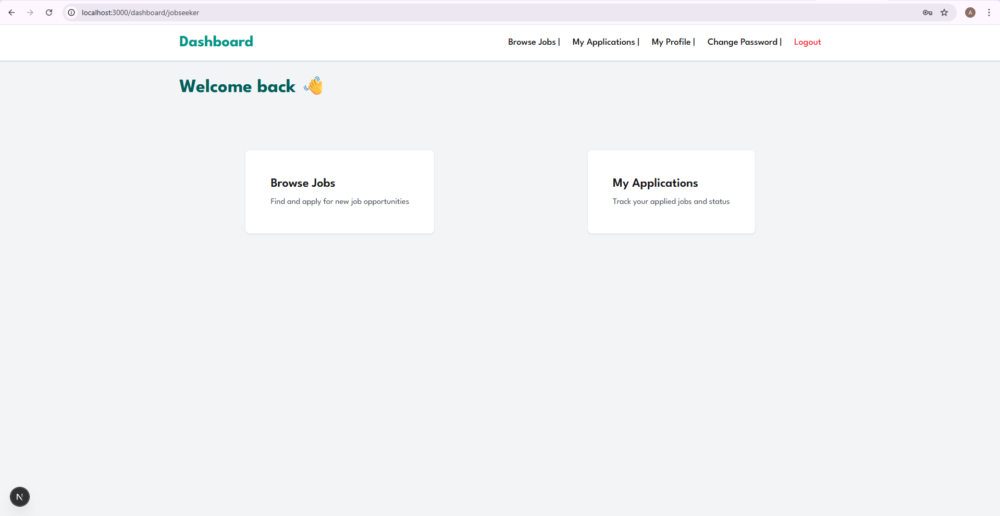

# Skillio – Job Portal Platform 🚀

**Skillio** is a modern, full-stack **Job Portal web application** designed to connect skilled job seekers with recruiters efficiently.  
Built using **Next.js, MongoDB, Node.js, and Tailwind CSS**, Skillio provides secure authentication, role-based dashboards, and a smooth hiring workflow.

---

## 🌟 Key Features

### 👨‍💼 Recruiter
- Recruiter dashboard
- Post, edit, and delete job listings
- View and manage job applicants
- Company profile management
- Secure change password functionality

### 👨‍🎓 Job Seeker
- Job seeker dashboard
- Browse and search jobs
- Apply for jobs
- Track application status (Pending / Shortlisted / Rejected)
- Profile management (skills, resume, personal details)
- Secure change password functionality

---

## 🔐 Authentication & Security
- JWT-based authentication
- Role-based access control (Recruiter / Job Seeker)
- Email verification
- Forgot password & reset password
- Password hashing using bcrypt
- Protected routes & dashboards

---

## 🛠 Tech Stack

### Frontend
- Next.js (App Router)
- React
- Tailwind CSS
- Axios

### Backend
- Next.js API Routes
- Node.js
- MongoDB & Mongoose
- JWT Authentication

### Tools & Services
- Cloudinary (resume & file uploads)
- Nodemailer (email services)
- Git & GitHub

---

## 📁 Project Structure

```text
src/
├── app/
│   ├── dashboard/
│   │   ├── recruiter/
│   │   └── jobseeker/
│   ├── jobs/
│   ├── login/
│   ├── signup/
│   ├── reset-password/
│   └── verify-email/
│
├── components/
├── models/
├── helpers/
├── lib/
├── proxy/
└── dbConfig/
```

---

## ⚙️ Environment Variables

Create a `.env` file in the root directory:

```env
MONGODB_URI=your_mongodb_connection_string
JWT_SECRET=your_jwt_secret
NEXT_PUBLIC_CLOUDINARY_CLOUD_NAME=your_cloud_name
CLOUDINARY_API_KEY=your_api_key
CLOUDINARY_API_SECRET=your_api_secret
EMAIL_USER=your_email
EMAIL_PASS=your_email_password
```

---

## 🚀 Getting Started

1️⃣ Clone the repository
git clone https://github.com/your-username/skillio-job-portal.git
cd skillio-job-portal

2️⃣ Install dependencies
npm install

3️⃣ Run the development server
npm run dev


The application will be available at:

http://localhost:3000

---

## 📸 Screenshots

### 👨‍💼 Recruiter Dashboard


### 📄 Job Listings


### 👩‍💻 Job Seeker Dashboard


### 👤 Profile Page


